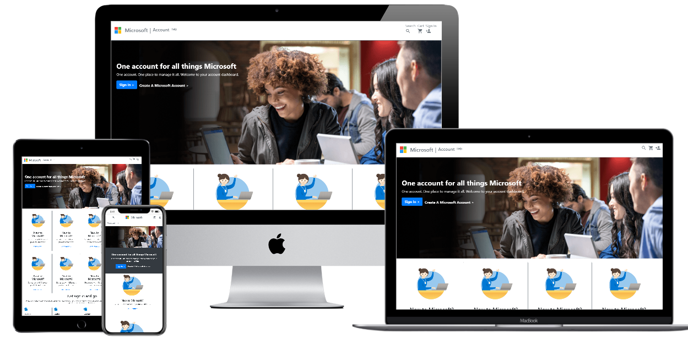

# Microsoft Web page - Capstone 1 Project Practice

This is a solo project where I had to replicate/clone the <a href="https://account.microsoft.com/account/Account?refd=login.live.com&ru=https%3A%2F%2Faccount.microsoft.com%2F%3Frefd%3Dlogin.live.com&destrt=home-index">Microsoft web page.</a>

## Preview of web page



## Built With

- HTML5
- CSS3
- <a href="https://materializecss.com/icons.html">Google icons</a>
- Bootstrap 4
- Sass

## Live Demo

<a href="https://raw.githack.com/chelmerrox/Capstone-1-Practice/project-draft/index.html">Live demo</a>

## Getting Started

To get a local copy up and running follow the simple steps outlined below.

## How To Use 🔧

From your command line, do the folowing steps below:
​
1. Clone the projects' repository into your machine.

```bash
# Clone this repository
$ git clone git@github.com:chelmerrox/Capstone-1-Practice.git

```
2. Change directory/Go into the repository with the command below.

```bash
$ cd Capstone-1-Practice

```

## Author

👤 **Losalini Rokocakau**
​
- Github: [@chelmerrox](https://github.com/chelmerrox)
- Twitter: [@chelmerrox](https://twitter.com/chelmerrox)
- Linkedin: [Losalini Rokocakau](https://www.linkedin.com/in/losalini-rokocakau)

## 🤝 Contributing

  Contributions, issues and feature requests are welcome!

  Feel free to check the [issues page](https://github.com/chelmerrox/Capstone-1-Practice/issues).

## Show your support

Give a ⭐️ if you like this project!

## Acknowledgments

- My Stand-Up Team
- <a href="https://github.com/BrittanyBlake">My Mentor</a>
- Microverse TSEs

## 📝 License

This project is [MIT](LICENSE.txt) licensed.